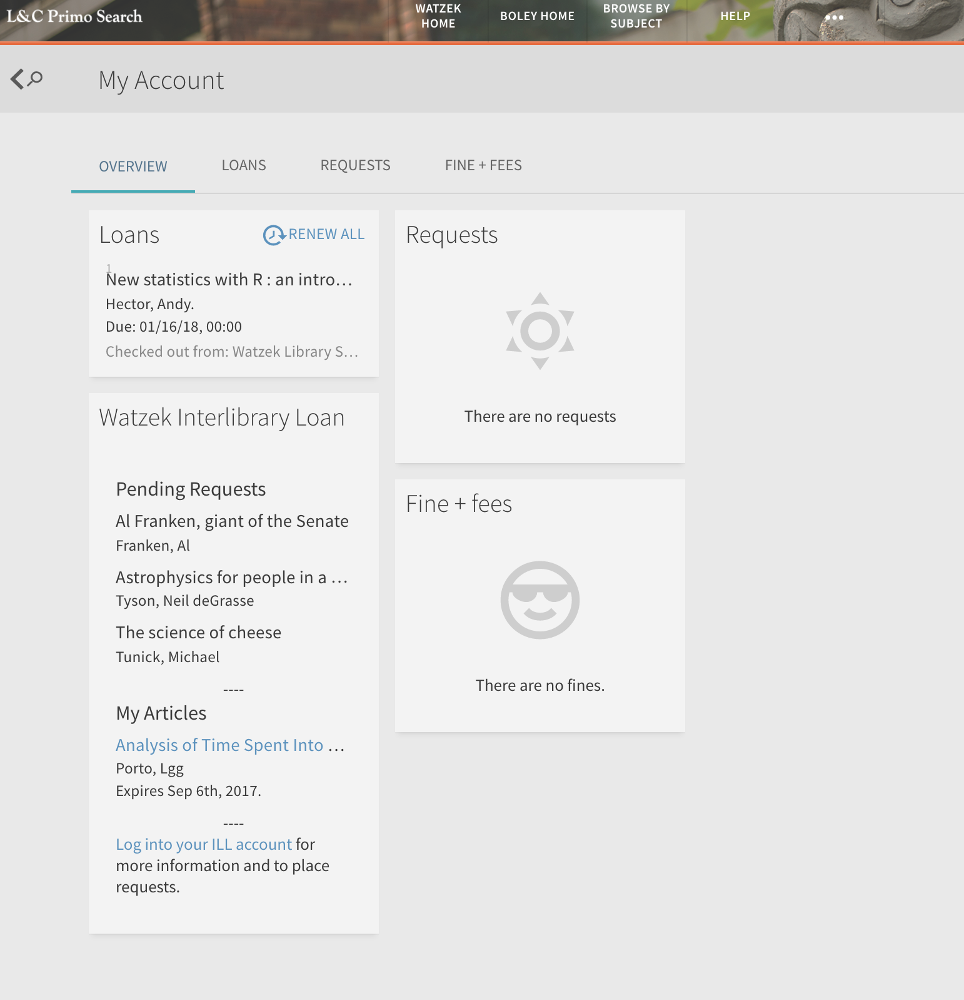

# primo-explore-my-ill
Load illiad requests &amp; articles into Primo "My Account"


# primo-explore-oadoi-link
Provides link to Open Access content for articles, when available

## Features
In a full display record, checks for the presence of a DOI. Queries the [OADOI API (v2)](https://oadoi.org/api/v2), and upon the presence of an open access link, displays a bar with the link under the "View It" section.

### Screenshot


## Install
1. Make sure you've installed and configured [primo-explore-devenv](https://github.com/ExLibrisGroup/primo-explore-devenv).
2. Navigate to your template/central package root directory. For example:
    ```
    cd primo-explore/custom/MY_VIEW_ID
    ```
3. If you do not already have a `package.json` file in this directory, create one:
    ```
    npm init -y
    ```
4. Install this package:
    ```
    npm install primo-explore-oadoi-link --save-dev
    ```

## Usage
Once this package is installed, add `oadoi` as a dependency for your custom module definition.

```js
var app = angular.module('viewCustom', ['oadoi'])
```

Note: If you're using the `--browserify` build option, you will need to first import the module with:

```javascript
import 'primo-explore-oadoi-link';
```

You can configure the banner by passing a configuration object. All properties are required.

| name      | type         | usage                                                                                   |
|-----------|--------------|-----------------------------------------------------------------------------------------|
| `imagePath` | string       | icon for next to the image link                                               |
| `email` | string       | email address attached to api query                                               |

The code below adds a banner similar to the above image.

```js
app.constant('oadoiOptions', {
  "imagePath": "custom/LCC/img/oa_50.png",
  "email": "youremail@domain.com"
})
```

<!-- ## Running tests
1. Clone the repo
2. Run `npm install`
3. Run `npm test` -->
